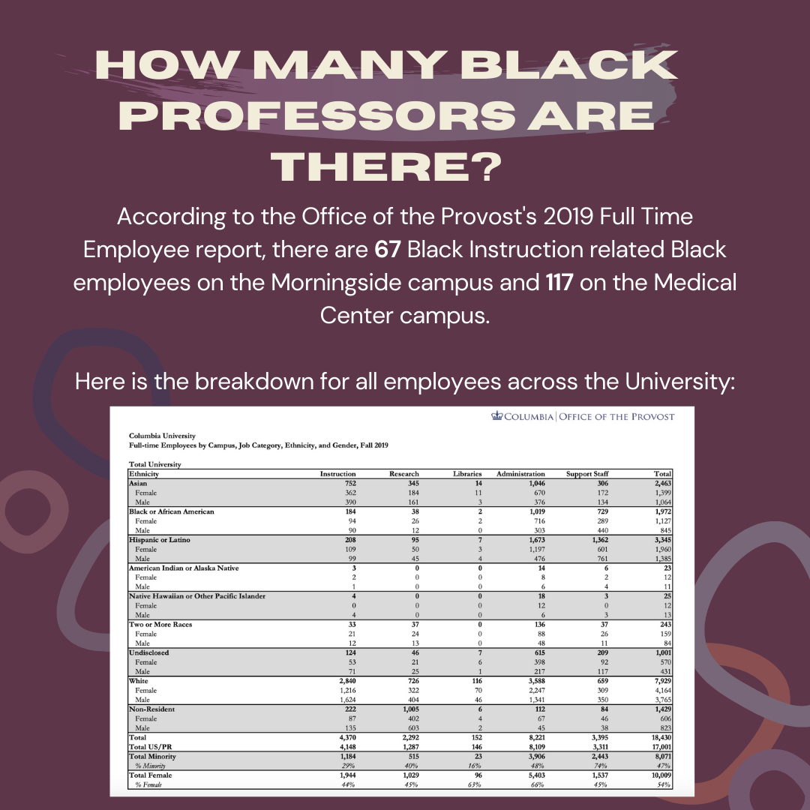

## Black Professorship at Columbia University

Post Created: 08/31/2020

### In confronting all of the ways Columbia is anti-Black, we must talk about the academic environment they have created for Black students. One where often Black students have to educate non Black students both in and out of the classroom and professors that don’t see the harm in bigotry and racism spewed in classroom discussions. Here is a look at the Black professors we currently have and the numbers are a little sad, 0 Black tenure professors in SEAS in the last 10 years? Only 117 Black teaching employees across the whole university? It is time to demand better and there are proven ways to get amazing Black scholars to teach at your institution, including providing them ample support early in their career and competitive pay. Prezbo’s email a few weeks ago suggested cluster hiring, which is a good start but we can go further. It is time that the University know that the students want them to prioritize this issue. 

