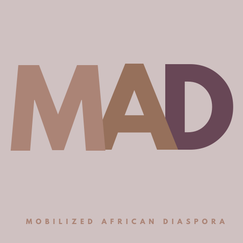

# IF YOU ARE READING THIS, PRESIDENT BOLLINGER HAS NOT RESPONDED TO OUR REQUEST FOR A MEETING WITHIN 48 HOURS
## LET'S HOLD HIM ACCOUNTABLE

To sign the petition, see here: [Petition](https://actionnetwork.org/petitions/mobilized-african-diaspora-demands?source=direct_link&){:target="_blank"}

To read the full demand letter to see our introduction and all of the citations of our claims, see here: [Full Demand Letter](https://docs.google.com/document/d/1yLZN0AyGZlvpnNxzbc9osaWMMeI7WjxGJo0Ujc1x98I/edit?usp=sharing){:target="_blank"}

## WHO WE ARE

Mobilized African Diaspora is a coalition of Black people at and affected by Columbia University committed to organizing against racism and structural oppression on campus and beyond. We organize to dismantle and restructure the racist, neocolonial University framework that negatively impacts Black students, staff, faculty, and those in the local and global community. MAD does not represent the voices of all Black people within this community, but instead functions as an open platform to combat the violences inflicted upon us. We work in solidarity with the Black student movements across the United States, and internationally. 

### TO DATE, WE HAVE RECEIVED SUPORT FROM 142 COLUMBIA UNIVERSITY STUDENT GROUPS AND WE ARE STILL GROWING. TO JOIN OUR MOVEMENT, PLEASE CONTACT US
